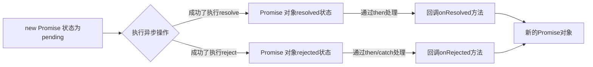

# Promise 进阶
## [JS 中的 error 处理](https://developer.mozilla.org/zh-CN/docs/Web/JavaScript/Reference/Errors)
### 错误的类型
- Error：所有错误的父类型
- ReferenceError：引用的变量不存在

	```js
	console.log(a)
	```
- TypeError：数据类型不正确

	```js
	const a = null;

	a.forEach(i => {
	  console.log(i);
	})
	```
- RangeError：数据值不在其所允许的范围内

	```js
	function name() {
	  name();
	}
	
	name();
	```
- SyntaxError：语法错误

	```js
	aaa a = 7;
	```
### 错误处理
- 捕获错误：`try...catch`

> 不捕获 error，下面的代码不会执行。

- 抛出错误：`throw error`

```js
function name() {
    if (Date.now()&2 === 1) {
      console.log('奇数');
    } else {
      throw new Error('是偶数');
    }
  }
  try {
    name();
  } catch (error) {
    console.log(error.message);
  }
```

### 错误对象
- `message` 属性：错误相关信息
- `stack` 属性：函数调用栈记录信息

## Promise 的理解和使用
### Promise 是什么
- 抽象表达：
	- Promise 是 JS 中进行异步编程的新的解决方案（旧的是纯回调方式）
- 具体表达：
	- 从语法上来说：Promise 是一个构造函数
	- 从功能上来说：Promise 对象用来封装一个异步操作并可以获取其结果

### Promise 的状态改变
1. pending 变为 resolved
2. pending 变为 rejected

> 只有这两种状态，且一个 Promise 对象只能改变一次。无论成功还是失败，都会有一个结果数据，成功为 value，失败为 reason。

### Promise 的基本流程


```js
  // 1. 创建一个 Promise 对象
  const p = new Promise((resolve, reject) => { // 执行器函数
    // 2. 执行异步操作任务
    setTimeout(() => {
      const time = Date.now();
      if (time%2 == 0) {
        resolve('成功的数据' + time)
      } else {
        reject('失败的数据' + time)
      }
    }, 1000);
    // 3.1 如果成功了，调用 resolve
    // 3.2 如果失败了，调用 reject
  })
  p.then(
    value => { // 接受得到成功的value数据  onResolved
      console.log('成功的数据', value);
    },
    reason => { // 接受得到失败的reason数据  onRejected
      console.log('失败的数据', reason);
    }
  )
```

## 为什么要用 Promise
**1. 指定回调函数的方式更加灵活**

- 旧的智能在启动异步任务前指定
- promise：启动异步任务 ➡️ 返回Promise 对象 ➡️ 给 promise 对象绑定回调函数

**2. 支持链式调用，可解决回调地域问题**

- promise 链式调用
- async/await

## 语法
**1. Promise 构造函数**

```js
Promise (excutor) {}
```

- excutor 函数：同步执行，`(resolve, reject) => {}`
	- resolve 函数：内部定义成功时调用的函数，`value => {}`
	- reject 函数：内部定义失败时调用的函数，`reason => {}`

**2. `Promise.prototype.then()`**

```js
(onPresolved, onRejected) => {}
```

- onResolved 函数：成功的回调函数 `value => {}`
- onRejected 函数：失败的回调函数 `reason => {}`

**3. `Promise.prototype.catch()`**

相当于 .then 的语法糖：

```js
then(undefined, onRejected)
```

**4. `Promise.resolve()`**

语法糖，产生一个成功的 promise。

```js
const p = Promise.resolve(1);

p.then(value => { console.log(value) }); // 输出 1
```

- value：成功的数据或 Promise 对象

**5. `Promise.reject()`**

语法糖，产生一个失败的 promise。

```js
(reason) => {}
```

- reason：失败的原因

**6. `Promise.all()`**

```js
(promises) => {}
```

- promises：包含n个promise的数组

> 返回一个新的 promise，只有所有的 promise 都成功才成功，一个失败则直接失败

**7. `Promise.race()`**

```js
(promises) => {}
```

> 返回一个新的 promise，**第一个完成的**promise结果状态就是最终的结果状态

## 几个关键问题
**1. 一个 promise 指定多个成功/失败的回调函数，都会调用吗？**

- 当 promise 改变为对应的状态都会调用

**2. 改变 promise 状态和指定回调函数谁先谁后？**

- 都有可能，正常情况下是限制低估回调再改变状态，但也可以先改状态再指定回调
- 如何先改状态再指定回调？
	- 1. 在执行器中直接调用 resolve() / reject()
	- 2. 延迟更长时间才调用 then(）
- 什么时候才能得到数据？
	- 1. 如果先指定回调，则当状态发生改变时，回调函数就会被调用，得到数据
	- 2. 如果先改状态，则当指定回调的时候，回调函数就会调用，得到数据

**3. promise.then() 返回的新 promise 的结果状态由什么决定？**

- 由 then() 指定的回调函数执行的结果决定
	- 如果抛出异常，新 promise 的状态为 rejected，reason 为抛出的异常
	- 如果返回的是非promise 的值，新 promise 的状态为 resolved，value 为返回的值
	- 如果返回的是另一个新的 promise，这个 promise 的结果就会成为新 promise 的结果

```js
  new Promise((resolve, reject) => {
      // resolve(1)
      reject(1)
  }).then(
    value => {
      console.log('onResolved1', value);
      return 2;
    },
    reason => {
      console.log('onRejected1', reason);
      return Promise.resolve(3);
    }
  ).then(
    value => {
      console.log('onResolved2', value);
    },
    reason => {
      console.log('onRejected2', reason);
    }
  )
```

---

**4. Promise 如何串联多个操作任务？**

- promise 的 then() 返回一个新的 Promise
- 通过 then 的链式调用串联多个同步/异步任务

**5. Promise 异常传透指的是？**

- 当使用 Promise 的 then() 链式调用时，可以在最后指定失败的回调
- 全段任何操作出了异常，都会传到最后失败的回调中处理

**6. 如何中断 Promise 链，不再调用后面的回调函数？**

- 在回调函数中返回一个 pendding 状态的 promise 对象。

```js
  new Promise((resolve, reject) => {
      reject(1)
  }).then(
    value => {
      console.log('onResolved1', value);
      return 2;
    },
    reason => {
      console.log('onRejected1', reason);
      return Promise.reject(222);
    }
  ).catch(reason => {
    console.log('catch', reason);
    return new Promise(() => {}); // pending 状态的 Promise 对象
  }).then(
    value => {
      console.log('onResolved2', value);
    },
    reason => {
      console.log('onRejected2', reason);
    }
  )
```

## 自定义 Promise
### 构造函数版
```js
/* 自定义 Promise 函数模块: IIFE */

(function (window) {
  /*
  Promise 构造函数
  excutor 执行器函数（同步执行）
  */

  const PENDING = 'pending';
  const RESOLVED = 'resolved';
  const REJECTED = 'rejected';

  function MyPromise(excutor) {
    const that = this;
    that.status = PENDING; // 给 Promise 的对象指定 status 属性，初始值为 pending
    that.data = undefined; // 给 Promise 对象指定一个用于存储结果数据的属性
    that.callbacks = []; // 每个元素的结构： { onResolved() {}, onRejected(){} }

    function resolve(value) {
      // 如果当前状态不是 pending，直接结束
      if (that.status !== PENDING) {
        return;
      }
      // 将状态改为 resolved
      that.status = RESOLVED;
      // 保存 value 数据
      that.data = value;
      // 如果有待执行的 callback 函数，立即异步执行回调函数 onResolved
      if (that.callbacks.length > 0) {
        setTimeout(() => { // 放入队列中执行所有成功的回调
          that.callbacks.forEach(callbacksObj => {
            callbacksObj.onResolved(value);
          })
        });
      }
    }

    function reject(reason) {
      // 将状态改为 rejected
      that.status = REJECTED;
      // 保存 reason 数据
      that.data = reason;
      // 如果有待执行的 callback 函数，立即异步执行回调函数 onRejected
      if (that.callbacks.length > 0) {
        setTimeout(() => { // 放入队列中执行所有成功的回调
          that.callbacks.forEach(callbacksObj => {
            callbacksObj.onRejected(reason);
          })
        });
      }
    }

    // 立即同步执行 excutor
    try {
      excutor(resolve, reject)
    } catch (error) { // 如果执行器抛出异常，promise 对象变为 reject 状态
      reject(error);
    }
  }

  /* Promise 原型对象的 then() */
  MyPromise.prototype.then = function (onResolved, onRejected) {

     // 指定默认的失败的回调，实现异常传透
    onResolved = typeof onResolved === 'function' ? onResolved : value => value; // 向后传递成功的 value
    onRejetced = typeof onRejected === 'function' ? onRejected : reason => { throw reason }; // 向后传递失败的 reason
    
    const that = this;
    // 返回一个新的 Promise 对象
    return new MyPromise((resolve, reject) => {
      // 调用指定的回调函数处理
      function handle(callback) {
        try {
          const result = callback(that.data);
          if (result instanceof MyPromise) {
            // 3. 如果回调函数执行返回的是 promise，return 的 promise 结果就是这个 promise的结果
            result.then(
              value => resolve(value), // 当 result 成功时，return 的 promise 也成功
              reason => reject(reason) // 当 result 失败时，return 的 promise 也失败
            )
          } else {
            // 2. 如果回调函数执行返回的不是 promise，return 的 promise 就会成功，value 为返回的值
            resolve(result);
          }
        } catch (error) {
          // 1. 如果抛出异常，return 的 promise 就会失败，reason 为 error
          reject(error);
        }
      }
      
      if (that.status === PENDING) {
        // 当前状态还是 pending 状态，将回调函数保存起来
        that.callbacks.push({
          onResolved(value){
            handle(onResolved);
          },
          onRejected(reason){
            handle(onRejected);
          }
        });
      } else if(that.status === RESOLVED){ // 如果当前是 resolved 状态，异步执行 onResolved 并改变 retuen 的 promise 状态
        setTimeout(() => {
          handle(onResolved);
        });
      } else { // status === 'rejected'
        setTimeout(() => {
          handle(onRejected);
        });
      }
    });
  }

  /* Promise 原型对象的 catch() */
  MyPromise.prototype.catch = function (onRejected) {
    return this.then(undefined, onRejected);
  }

  /* Promise 函数对象的 resolve 方法 */
  MyPromise.resolve = function (value) {
    return new MyPromise((resolve, reject) => {
      if (value instanceof MyPromise) { // value 的结果作为promise 的结果
        value.then(resolve, reject);
      } else { // value 不是 promise，promise成功，数据为 value
        resolve(value);
      }
    });
  }

  /* Promise 函数对象的 reject 方法 */
  MyPromise.reject = function (reason) {
    return new MyPromise((resolve, reject) => {
      reject(reason);
    });
  }

  // Promise 函数对象的 all 方法
  MyPromise.all = function (promises) {

    const values = new Array(promises.length); //用来保存所有成功value 的数组
    let resolveCount = 0; // 保存成功 promise 的数量
    return new MyPromise((resolve, reject) => {

      // 遍历获取每个 promise 的结果
      promises.forEach((p, index) => {
        MyPromise.resolve(p).then(
          value => { // p成功，将成功的 value 存入values
            values[index] = value;
            resolveCount++;
            // 如果全部成功，将return 的promise变为成功
            if (resolveCount === promises.length) {
              resolve(values);
            }
          },
          reason => { // 只要一个失败了，retuen 的promise就失败
            reject(reason);
          }
        )
      })
    })
  }

  // Promise 函数对象的 race 方法
  MyPromise.race = function (promises) {
    return new MyPromise((resolve, reject) => {
      // 遍历获取每个 promise 的结果
      promises.forEach(p => {
        MyPromise.resolve(p).then(
          value => { // 一旦有成功了，return 成功
            resolve(value);
          },
          reason => { // 一旦有成功了，return 成功
            reject(reason);
          }
        )
      })
    })
  }

  // 返回一个 promise 对象，在指定的时间后才确定结果
  MyPromise.resolveDelay = function (value, time) {
    return new MyPromise((resolve, reject) => {
      setTimeout(() => {
        if (value instanceof MyPromise) {
          value.then(resolve, reject);
        } else {
          resolve(value);
        }
      }, time);
    });
  }

  // 返回一个 promise 对象，在指定的时间后才失败
  MyPromise.rejectDelay = function (reason, time) {
    return new MyPromise((resolve, reject) => {
      setTimeout(() => {
        reject(reason);
      }, time);
    });
  }

  // 向外暴露 Promise 函数
  window.MyPromise = MyPromise;
})(window)
```

### Class 版
```js
/* 自定义 Promise 函数模块: IIFE */

(function (window) {

  const PENDING = 'pending';
  const RESOLVED = 'resolved';
  const REJECTED = 'rejected';

  class MyPromise {
    /*
  Promise 构造函数
  excutor 执行器函数（同步执行）
  */
    constructor(excutor) {
      const that = this;
      that.status = PENDING; // 给 Promise 的对象指定 status 属性，初始值为 pending
      that.data = undefined; // 给 Promise 对象指定一个用于存储结果数据的属性
      that.callbacks = []; // 每个元素的结构： { onResolved() {}, onRejected(){} }

      function resolve(value) {
        // 如果当前状态不是 pending，直接结束
        if (that.status !== PENDING) {
          return;
        }
        // 将状态改为 resolved
        that.status = RESOLVED;
        // 保存 value 数据
        that.data = value;
        // 如果有待执行的 callback 函数，立即异步执行回调函数 onResolved
        if (that.callbacks.length > 0) {
          setTimeout(() => { // 放入队列中执行所有成功的回调
            that.callbacks.forEach(callbacksObj => {
              callbacksObj.onResolved(value);
            })
          });
        }
      }

      function reject(reason) {
        // 将状态改为 rejected
        that.status = REJECTED;
        // 保存 reason 数据
        that.data = reason;
        // 如果有待执行的 callback 函数，立即异步执行回调函数 onRejected
        if (that.callbacks.length > 0) {
          setTimeout(() => { // 放入队列中执行所有成功的回调
            that.callbacks.forEach(callbacksObj => {
              callbacksObj.onRejected(reason);
            })
          });
        }
      }

      // 立即同步执行 excutor
      try {
        excutor(resolve, reject)
      } catch (error) { // 如果执行器抛出异常，promise 对象变为 reject 状态
        reject(error);
      }
    }

    /* Promise 原型对象的 then() */
    then(onResolved, onRejected) {

      // 指定默认的失败的回调，实现异常传透
      onResolved = typeof onResolved === 'function' ? onResolved : value => value; // 向后传递成功的 value
      onRejected = typeof onRejected === 'function' ? onRejected : reason => {
        throw reason
      }; // 向后传递失败的 reason

      const that = this;
      // 返回一个新的 Promise 对象
      return new MyPromise((resolve, reject) => {
        // 调用指定的回调函数处理
        function handle(callback) {
          try {
            const result = callback(that.data);
            if (result instanceof MyPromise) {
              // 3. 如果回调函数执行返回的是 promise，return 的 promise 结果就是这个 promise的结果
              result.then(
                value => resolve(value), // 当 result 成功时，return 的 promise 也成功
                reason => reject(reason) // 当 result 失败时，return 的 promise 也失败
              )
            } else {
              // 2. 如果回调函数执行返回的不是 promise，return 的 promise 就会成功，value 为返回的值
              resolve(result);
            }
          } catch (error) {
            // 1. 如果抛出异常，return 的 promise 就会失败，reason 为 error
            reject(error);
          }
        }

        if (that.status === PENDING) {
          // 当前状态还是 pending 状态，将回调函数保存起来
          that.callbacks.push({
            onResolved(value) {
              handle(onResolved);
            },
            onRejected(reason) {
              handle(onRejected);
            }
          });
        } else if (that.status === RESOLVED) { // 如果当前是 resolved 状态，异步执行 onResolved 并改变 retuen 的 promise 状态
          setTimeout(() => {
            handle(onResolved);
          });
        } else { // status === 'rejected'
          setTimeout(() => {
            handle(onRejected);
          });
        }
      });
    }

    /* Promise 原型对象的 catch() */
    catch(onRejected) {
      return this.then(undefined, onRejected);
    }

    /* Promise 函数对象的 resolve 方法 */
    static resolve = function (value) {
      return new MyPromise((resolve, reject) => {
        if (value instanceof MyPromise) { // value 的结果作为promise 的结果
          value.then(resolve, reject);
        } else { // value 不是 promise，promise成功，数据为 value
          resolve(value);
        }
      });
    }

    /* Promise 函数对象的 reject 方法 */
    static reject = function (reason) {
      return new MyPromise((resolve, reject) => {
        reject(reason);
      });
    }

    // Promise 函数对象的 all 方法
    static all(promises) {

      const values = new Array(promises.length); //用来保存所有成功value 的数组
      let resolveCount = 0; // 保存成功 promise 的数量
      return new MyPromise((resolve, reject) => {

        // 遍历获取每个 promise 的结果
        promises.forEach((p, index) => {
          MyPromise.resolve(p).then(
            value => { // p成功，将成功的 value 存入values
              values[index] = value;
              resolveCount++;
              // 如果全部成功，将return 的promise变为成功
              if (resolveCount === promises.length) {
                resolve(values);
              }
            },
            reason => { // 只要一个失败了，retuen 的promise就失败
              reject(reason);
            }
          )
        })
      })
    }

    // Promise 函数对象的 race 方法
    static race(promises) {
      return new MyPromise((resolve, reject) => {
        // 遍历获取每个 promise 的结果
        promises.forEach(p => {
          MyPromise.resolve(p).then(
            value => { // 一旦有成功了，return 成功
              resolve(value);
            },
            reason => { // 一旦有成功了，return 成功
              reject(reason);
            }
          )
        })
      })
    }

    // 返回一个 promise 对象，在指定的时间后才确定结果
    static resolveDelay(value, time) {
      return new MyPromise((resolve, reject) => {
        setTimeout(() => {
          if (value instanceof MyPromise) {
            value.then(resolve, reject);
          } else {
            resolve(value);
          }
        }, time);
      });
    }

    // 返回一个 promise 对象，在指定的时间后才失败
    static rejectDelay(reason, time) {
      return new MyPromise((resolve, reject) => {
        setTimeout(() => {
          reject(reason);
        }, time);
      });
    }
  }

  // 向外暴露 Promise 函数
  window.MyPromise = MyPromise;
})(window)
```

### 宏队列与微队列
- JS 中用来存储执行回调函数的队列包含 2 个不同的特定队列
	- 宏队列：用来保存待执行的宏任务（回调），比如：定时器回调、DOM 事件回调、AJAX 回调
	- 微队列：
	- 用来保存待执行的微任务（回调），比如：Promise 的回调、MutationObserver 回调


- JS 执行时会区别这两个队列
	- 首先必须执行所有的初始化同步任务代码
	- 每次准备取出第一个宏任务执行之前，都要将所有的微任务一个一个取出来执行

## 练习
```js
setTimeout(() => { // 放入宏队列，执行完同步任务后准备取出，但需要把所有微任务执行完
  console.log(1);
}, 0);

Promise.resolve().then(() => { // 放入微任务队列
  console.log(2);
})

Promise.resolve(1).then(() => { // 放入微任务队列
  console.log(4);
})

console.log(3); // 先执行同步任务

// 3 2 4 1
```

```js
setTimeout(() => { // 宏任务
  console.log(1);
}, 0);

new Promise((resolve) => {
  console.log(2); // 同步任务1
  resolve();
}).then(() => {
  console.log(3); // 微任务1
}).then(() => {
  console.log(4); // 微任务2
})

console.log(5); // 同步任务2

// 2 5 3 4 1
```

```js
const first = () => (new Promise((resolve, reject) => {
  console.log(3); // 同步任务1
  let p = new Promise((resolve, reject) => {
    console.log(7); // 同步任务2
    setTimeout(() => {
      console.log(5);
      resolve(6);
    }, 0);
    resolve(1);
  })
  resolve(2);
  p.then((arg) => {
    console.log(arg);
  })
}))

first().then((arg) => {
  console.log(arg);
})
console.log(4); // 同步任务3

// 宏 [5]
// 微 [1 2]

// 3 7 4 1 2 5
```

```js
setTimeout(() => {
  console.log(0);
}, 0);
new Promise((resolve, reject) => {
  console.log(1);
  resolve();
}).then(() => {
  console.log(2);
  new Promise((resolve, reject) => {
    console.log(3);
    resolve()
  }).then(() => {
    console.log(4);
  }).then(() => {
    console.log(5); // 4 没有执行不能执行5，即5不能跟在4后放在微任务队列
  })
}).then(() => {
  console.log(6);
})

new Promise((resolve, reject) => {
  console.log(7);
  resolve();
}).then(() => {
  console.log(8);
})

// 同步：1 7
// 宏：[0 ]
// 微：[2 8 4 6 5]

// 1 7 2 3 8 4 6 5 0
```

