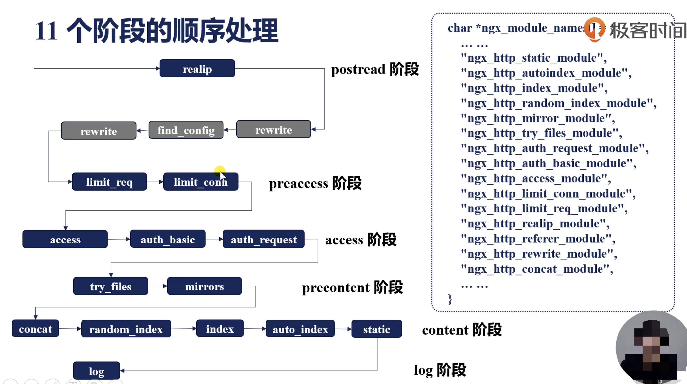

# Nginx
## 初识 Nginx
**Nginx 的三个主要使用场景：**

- 静态资源
- API 服务
- 反向代理
	- 缓存加速
	- 负载均衡

> 为什么 Apache 低效？

> Apache 一个连接只能对应一个线程，而服务器进程数有限，当十万、百万级并发时不可能同时开启这么多线程，线程间切换也会耗费大量性能。

**Nginx 的主要优点**

- 高并发、高性能
- 可扩展性好（模块化设计）
- 高可靠性
- 热部署
- [BSD 许可](https://zh.wikipedia.org/wiki/BSD%E8%AE%B8%E5%8F%AF%E8%AF%81)

**下载安装最新版本的 Nginx**

- 复制[官网](https://nginx.org/en/download.html)最新版本的链接，执行 `wget $link`
- 解压 Nginx 文件：`tar -xzf nginx_file.tar.gz`
- 生成编辑中间文件：`./configure --prefix=/usr/local/nginx --with-http_ssl_module`，结果位于 `objs` 目录
> 一些报错：
> 
> 1. the HTTP rewrite module requires the PCRE library
> `sudo apt-get install libpcre3-dev`
> 2. the HTTP gzip module requires the zlib library.
> `sudo apt-get install zlib1g-dev`
> 3. error: SSL modules require the OpenSSL library.
> `sudo apt-get install libssl-dev`

- 编译：`make`
- 安装：`make install`

> vim 高亮 nginx 配置文件语法：`cp -r contrib/vim/* ~/.vim/`

**Nginx 的组成**

- nginx 二进制可执行文件
- nginx.conf 配置文件
- access.log 访问日志
- error.log 错误日志

**Nginx 命令行**

- 使用指定的配置文件： -c
- 指定运行目录：-p
- 发送信号：-s
	- 立刻停止：stop
	- 优雅停止：quit
	- 重载配置：reload
	- 重新开始记录日志：reopen
- 测试配置文件是否有语法错误：-t

**热部署**

1. 下载新版本的 nginx，备份旧的二进制文件：

	```s
	$ cd /usr/local/nginx/sbin
	$ cp nginx nginx.bak
	```

2. 替换旧版本的二进制文件为新版的
	make 后的二进制文件是 `objs/nginx`，复制替换原来的 `sbin/nginx`

3. 给旧的 nginx master 进程发送信号新启动一个新版本的进程：`kill -USR2 $old_pid
4. 优雅关闭旧版的 worker 进程：`kill -WINCH $old_pid`
5. 老的 master 进程作版本回退用，可 `kill` 掉

## 配置 Nginx
### 搭建静态资源 Web 服务器
- alias：指定访问的根目录
- gzip 压缩：

```nginx
http {
    gzip  on;
    # 小于多少字节不压缩
    gzip_min_length 1;
    # 压缩级别
    gzip_comp_level 2;
    # 哪些文件类型需要压缩
    gzip_types text/plain application/javascript application/x-javascript text/css application/xml text/javascript application/x-http-php image/jpeg image/gif image/png;
}
```

- 限制每秒最大传输的数据大小：

```nginx
set $limit_rate 1k;
```

- 日志：

```nginx
http {
	# 指定日志格式，main 为格式的名字
	log_format  main  '$remote_addr - $remote_user [$time_local] "$request" '
                      '$status $body_bytes_sent "$http_referer" '
                      '"$http_user_agent" "$http_x_forwarded_for"';
                      
    server {
        # 指定log输出目录及采用的格式
        access_log logs/myvue3.access.log main;
    }
}
```

### 搭建反向代理服务
方向代理服务器配置只允许本机访问：

```nginx
server {
    listen 127.0.0.1:80;
}
```

上游 nginx 配置：

```nginx
http {
    upstream local {
	    server 127.0.0.1;
    }
    
    server {
        location / {
            # 将访问的域名转发给反向代理服务器
            proxy_set_header Host $host;
            # 将客户端 IP 转发（不一定是真实IP，也有可能是最后一台反向代理服务器IP）
          	proxy_set_header X-Real_IP $remote_addr;
          	# 将客户端真实的 IP 转发（如果客户端有反向代理服务器，会逐个追加IP）
          	proxy_set_header X-Forwarded_For $proxy_add_x_forward_for;

            # 将请求转发到反向代理服务器
            proxy_pass http://local;
        }
    }
}
```

### 使用 GoAccess 分析 Nginx Log
**安装：**

```shell
$ apt install libmaxminddb-dev
$ apt-get install libgeoip-dev
$ apt-get install libncurses5-dev
$ wget https://tar.goaccess.io/goaccess-1.5.5.tar.gz
$ tar -xzvf goaccess-1.5.5.tar.gz
$ cd goaccess-1.5.5/
$ ./configure --enable-utf8 --enable-geoip=mmdb
$ make
$ make install
```

**使用：**

- nginx 配置中添加报告页面：

```nginx
        location /goaccess-report {
            alias /usr/local/nginx/logs;
            index report.html;
        }
```

- 生成报告：

```s
$ goaccess access.log -o report.html --real-time-html --time-format='%H:%m:%S' --date-format='%d/%b/%Y' --log-format=COMBINED
```


### 配置 HTTPS
unbuntu 安装 certbot 和 python3-certbot-nginx：

```s
$ apt install certbot python3-certbot-nginx
```

安装证书：

```s
$ certbot --nginx --nginx-server-root=/usr/local/nginx/conf/ -d zander.fun
```

> `nginx-server-root` 用于指定配置文件位置，默认为 `/etc/nginx` 或 `/usr/local/etc/nginx`，`-d` 指定要安装证书的域名。

> 若遇到 certbot [error] invalid PID number "" in "/run/nginx.pid" 问题，需执行 `cat /usr/local/nginx/logs/nginx.pid > /run/nginx.pid` 将默认的 Nginx 进程 ID 写入到 certbot 需要读取的文件中。


HTTPS 连接最耗时的是**握手**，certbot 会默认添加以下配置优化：

```s
# 1M的缓存可支持大约4000个连接
ssl_session_cache shared:le_nginx_SSL:1m;
# 缓存过期时间：一天
ssl_session_timeout 1440m;
```

## Nginx 架构
Nginx 默认为**多进程**结构：

- master 进程：管理 worker 进程，父子进程间通过信号管理 
	- CHILD：监控worker进程，子进程终止时会向父进程发送这个信号
	- 接收信号管理 worker 进程
		- TERM，INT：立刻停止进程，等同于 `stop` 命令
		- QUIT：优雅停止进程，等同于 `quit` 命令
		- HUP：重载配置文件，等同于 `reload` 命令
		- USR1：重新打开日志文件，等同于 `repoen` 命令
		- USR2：启动新的 master 进程，只能通过 `kill` 命令触发
		- WINCH：优雅关闭 worker 进程，只能通过 `kill` 命令触发
- worker 进程：处理请求
	- TERM，INT
	- QUIT
	- USR1
	- WINCH
- Cache manager
- Cache loader

### reload 流程
1. 向 master 进程发送 HUP 信号
2. master 进程校验配置语法是否正确
3. master 进程打开新的监听端口（比如新增了 443 端口）
4. master 进程用新配置启动新的 worker 子进程
5. master 进程向旧的 worker 进程发送 QUIT 信号
6. 老 worker 进程关闭监听句柄，处理完当前连接后关闭进程

### 热升级流程
1. 将旧的 Nginx 二进制文件替换为新的二进制文件（`cp -r new old -f`）
2. 向 master 进程发送 USR2 信号
3. master 进程修改 pid 文件名，后缀为 `.oldbin`
4. master 进程用新的 Nginx 文件启动新 master 进程
5. 向老的 master 进程发送 QUIT 信号以关闭进程

> 回滚：向旧的 master 进程发送 HUP 信号，向新的 master 进程发送 QUIT 信号

### worker 进程：优雅的关闭
1. 设置定时器 worker_shutdown_tiemout
2. 关闭监听句柄
3. 关闭空闲连接
4. 轮询等待连接全部关闭
5. 退出进程

### Nginx 的模块
查看模块：编译完成后进入 `./objs` 目录，查看 `ngx_modules.c` 文件。

Nginx 核心模块：


### 共享内存
Worker 进程之间通过**共享内存**可进行进程间协同，共享数据。共享内存中使用红黑树来管理数据，插入、删除操作效率极高。

共享内存通过 Slab 管理器来分配内存。

### Nginx 中的容器
- 数组
- 链表
- 队列
- **哈希表**
- **红黑树**
- 基数树

#### 哈希表
以 key-value 的形式连续存储，将 value 通过哈希函数映射到相应的哈希表位置。Nginx 的哈希表仅应用于存储静态不变的内容，Nginx 刚启动时已经可以确定哈希表中的元素个数。


使用哈希表的模块：


> 配置 bucket size 时需要考虑对齐问题，一般设置为 CPU Cache Line，防止读取哈希表值时的多次访问。

#### 红黑树


特点：

- 高度不会超过 2 倍 log(n)
- 增删改查算法复杂度为 O(log(n))
- 遍历复杂度 O(n)

## HTTP 模块
```nginx
main
http {
    upstream {...}
    split_clients {...}
    map {...}
    geo {...}
    server {
        if(){...}
        location {
            limit_except {...}
        }
        location {
            location {...}
        }
    }
    server {...}
}
```

不同 Context 下指令的合并遵循以下规则：

- 值指令：存储匹配项的值
    - 可以合并
    - 例如：root、access_log、gzip
    - 继承规则：子配置存在时，直接覆盖父模块配置；子配置不存在时，直接使用父模块配置
- 动作类指令：指定行为
    - 不可以合并
    - 例如：rewrite、proxy_pass
    - 生效阶段：server_rewrite 阶段、rewrite 阶段、content 阶段

### Listen 指令
指定服务监听的地址。支持指定 address[:port]、port 或 unix:path。示例：

```
listen 127.0.0.1:8080;
listen 127.0.0.1;
listen 8000;
listen *:8000;
listen localhost:8000 bind; # 旧的 linux 系统
listen unix:/var/run/nginx.sock;
listen [::]:8000 ipv6only=on;
listen [::1];
```

### 处理 HTTP 请求头部的流程


### 如何找到处理请求的 server 指令块
`server_name` 指令：

- 可指定一个或多个域名，第一个为主域名
- 可指定泛域名（只支持把 * 写在最前面或最后面），如：`server_name: *.zander.fun`
- 正则表达式匹配

> 当配置了多个域名时，可使用 `server_name_in_redirect` 指令将返回主域名的 Location，该指令默认为关闭。

server_name 的匹配顺序：

1. 精确匹配
2. *在前的泛域名
3. *在后的泛域名
4. 按文件中的顺序匹配正则表达式域名
5. default server
    - 第 1 个
    - listen 指定 default 关键字

### 处理 HTTP 请求的 11 个阶段⭐️


1. POST_READ：读取到请求后，还未进行任何处理。
2. SERVER_REWRITE
3. FIND_CONFIG
4. REWRITE
5. POST_REWRITE
6. PREACCESS
7. ACCESS：处理访问认证的操作
8. POST_ACCESS
9. PRECONTENT
10. CONTENT
11. LOG：打印 access_log 日志



### 如何拿到真实的用户 IP 地址？
网络中可能存在很多反向代理导致最后获取的用户 IP 不是真实的 IP。HTTP 请求头中有两个属性用于传递 IP：

- X-Forwarded-For：可多个，用于传递上一个 IP
- X-Real—IP：只能一个，用于传递真实的用户 IP

运用 realip 模块获取及使用真实 IP：

1. 添加 realip 模块(默认不会编译进 Nginx)

```s
--with-http_realip_module
```

2. Nginx 配置中使用 realip 模块的指令

```nginx
server {
    server_name zander.fun;
    # 设置从哪个服务器过来的请求才触发 realip
    set_real_ip_from 43.142.117.212;
    # 设置真实的 IP 从哪个属性取
    #real_ip_header X-Real-IP;
    real_ip_header X-Forwarded-For;
    # 是否归还最后一个 IP（若 X-Forwarded-For 的最后一个 IP 是 set_real_ip_from，则忽略取前一个）
    real_ip_recursive on;

    location / {
        return 200 "Client real ip is $remote_addr\n";
    }
}
```

> 使用 `curl -H 'X-Forwarded-For: 1.1.1.1,43.142.117.212' zander.fun` 进行测试

### REWRITE 阶段的 rewrite 模块
if 指令：

- Syntax: `if(condition) {...}`
- Context: server、Location
- 条件 condition 若为真，则执行大括号内的指令；遵循值指令的继承原则。

例子：

```nginx
// 判断是 IE 浏览器
if($http_user_agent ~ MSIE){
    rewrite ^(.*)$/msie/$1 break;
}
// 取出 cookie 中的 id，做进一步处理
if($http_cookie ~* "id=([^;]+)(?:;|$)"){
    set $id $1;
}
// 阻止 POST 请求
if($http_method=POST){
    return 405;
}
// 判断自定义变量
if($slow){
    limit_rate 10k;
}
// 判断导链请求
if($invalid_referer){
    return 403;
}
```

**匹配规则：**

字符串：

- 常规字符串
- =：精确匹配
- ^~：匹配上后不再进行正则表达式匹配

正则表达式：

- ~：大小写敏感
- ~*：忽略大小写

用于内部跳转的命名 location：

- @

**规则匹配优先级：**


### 对连接做限制的 limit_conn 模块
